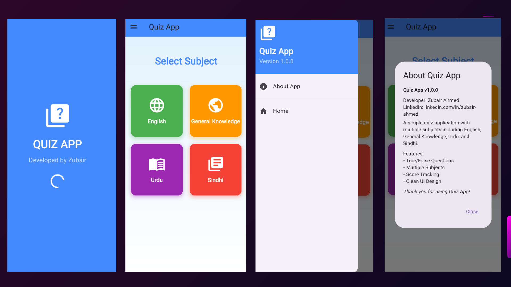
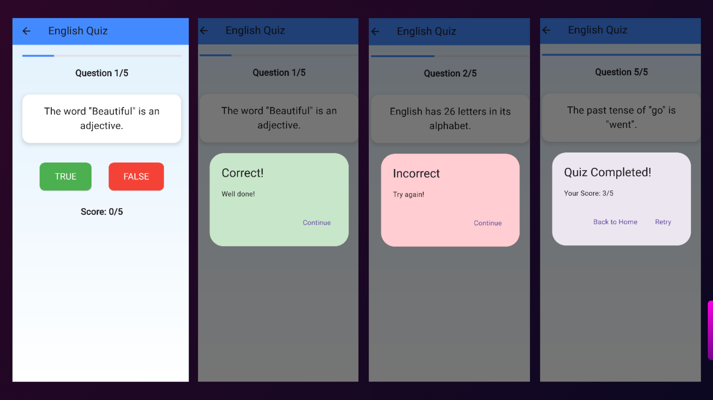
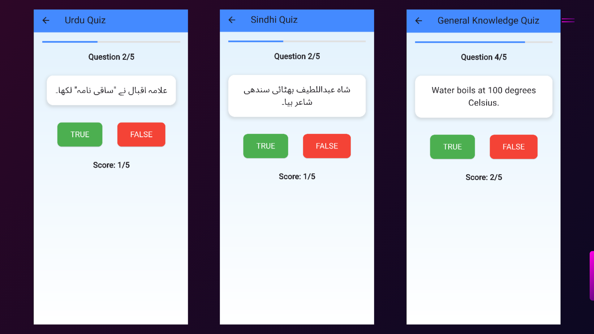

# 📱 Quiz App  

A modern, interactive quiz application built with **Flutter** that tests knowledge across multiple subjects including **English, General Knowledge, Urdu, and Sindhi**.  

---

## ✨ Features  

- 📚 **Multi-Subject Quizzes**: English, General Knowledge, Urdu, and Sindhi  
- 🎨 **Interactive UI**: Clean, modern design with smooth animations  
- 📊 **Real-time Scoring**: Track your progress as you answer questions  
- ⚡ **Instant Feedback**: Get immediate responses for correct/incorrect answers  
- 📈 **Progress Tracking**: Visual progress bar for each quiz session  
- ℹ️ **About Section**: App information and developer details  
- 📱 **Responsive Design**: Works seamlessly across different screen sizes  
- 🎯 **True/False Format**: Simple and engaging question format  
- 🌐 **Multi-Language Support**: Questions in English, Urdu, and Sindhi  
- 🎊 **Beautiful Animations**: Smooth transitions and loading effects  
- 🏆 **Score Display**: Real-time score tracking and final results  
- 🎮 **User-Friendly**: Intuitive navigation and clean interface  

---

## 📸 Screenshots  

  
  
  

---

## 🚀 Getting Started  

### ✅ Prerequisites  
- Flutter SDK (>=2.17.0)  
- Dart SDK  
- Android Studio / VS Code  
- Android/iOS device or emulator

---
🌟 Future Enhancements

- 🔢 Multiple choice questions
- ⏰ Timer functionality
- 🔊 Sound effects
- 🏆 Online leaderboard
- 📖 More subject categories
- 🌙 Dark theme support
- 📊 Question difficulty levels
- 🎖️ Achievement system
---
⭐ Show Your Support
- If you found this project helpful, don’t forget to star ⭐ the repository!
---
👨‍💻 
Zubair Ahmed
- 🔗 LinkedIn: https://www.linkedin.com/in/zubairahmed56/
- 📧 Email: exzubair.66@gmail.com
